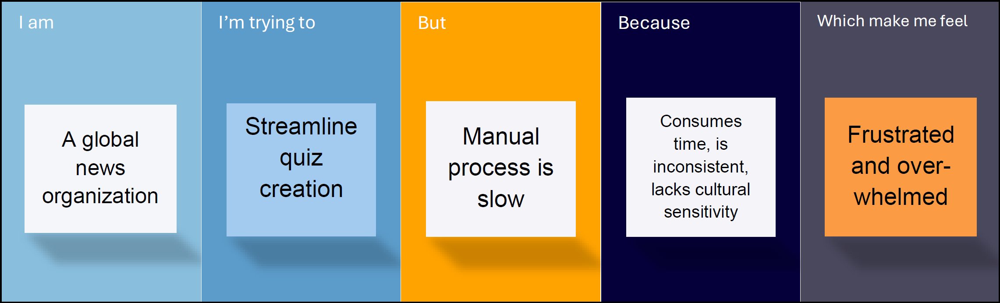
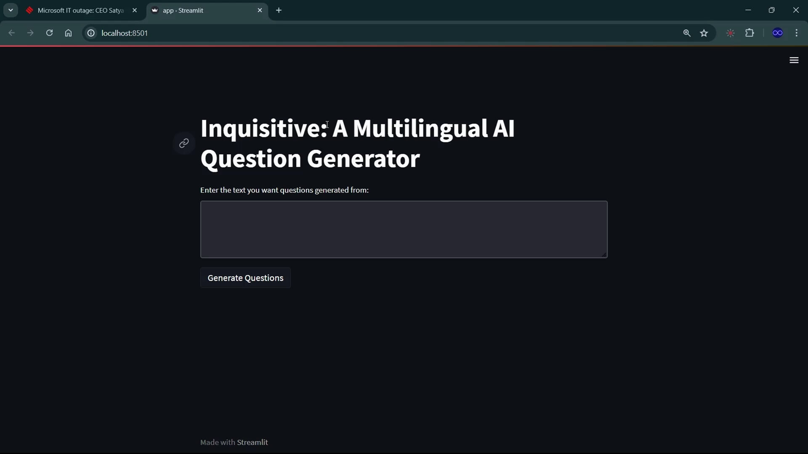
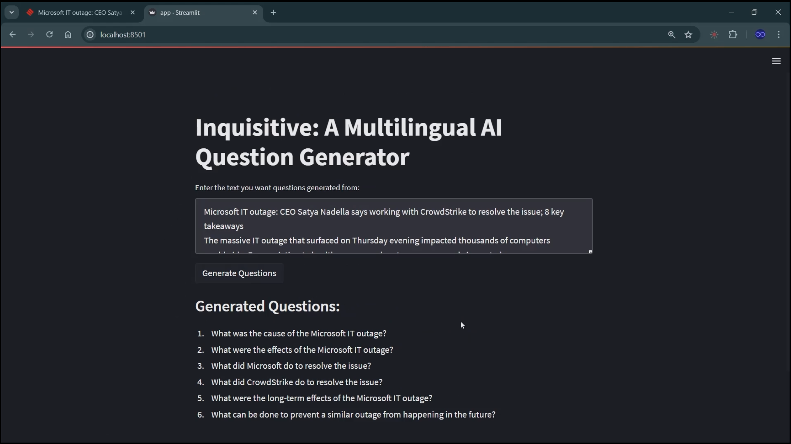
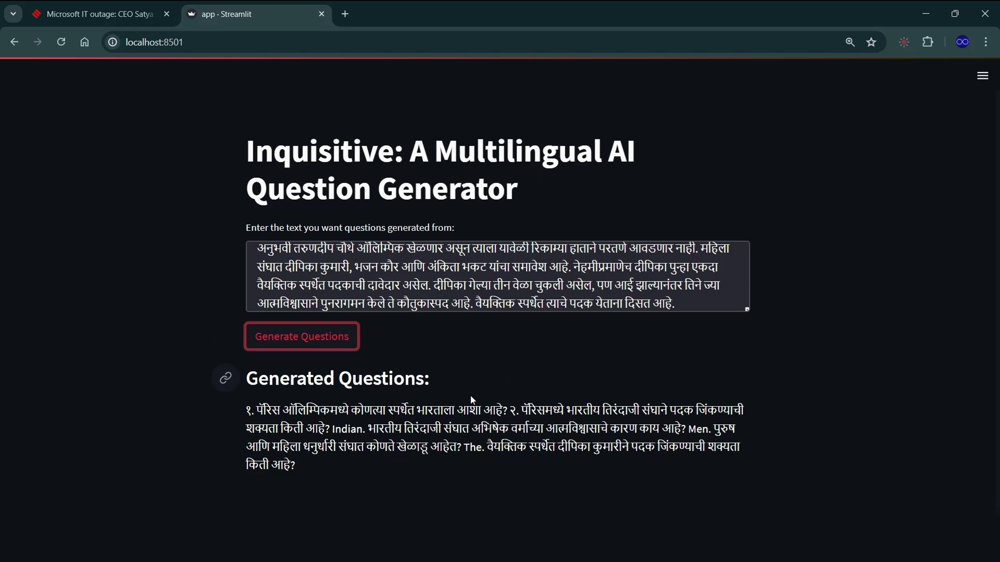
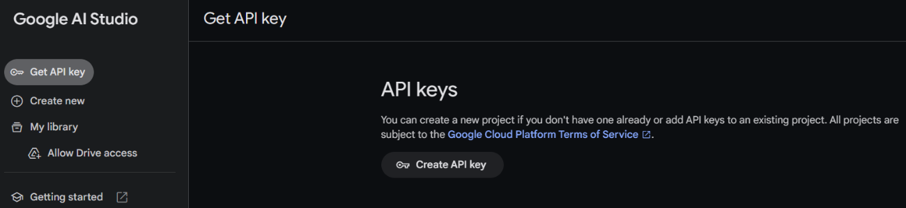

# `Inquisitive:` AI Powered Multilingual Question Generator

<!-- <hr> -->
&nbsp;&nbsp;&nbsp;&nbsp;
This repository contains a Generative AI project created using Gemini API.  
It is a simple multilingual AI powered questions generator based on the news article provided.  
Project is developed under the `Generative AI Applications using Vertex AI` course by SmartBridge in collaboration with Google.


## Table of Contents

- [`Inquisitive:` AI Powered Multilingual Question Generator](#inquisitive-ai-powered-multilingual-question-generator)
  - [Table of Contents](#table-of-contents)
  - [Problem Statement](#problem-statement)
  - [Our Solution](#our-solution)
    - [Objective:](#objective)
    - [Scope:](#scope)
    - [Approach:](#approach)
  - [Implementation](#implementation)
  - [Impact](#impact)
  - [Tech-Stack 💻](#tech-stack-)
  - [Installation](#installation)
  - [Links](#links)
  - [Team-mates](#team-mates)
  - [Contributions](#contributions)
    - [Contact](#contact)

## Problem Statement
&nbsp; &nbsp; &nbsp;
Our client, NewsSphere, is a leading news organization dedicated to expanding its global reach and enhancing audience engagement. With a vast amount of content published daily in multiple languages, the organization faces the considerable challenge of manually creating quizzes and
assessments for each article. This process is not only time-consuming but also prone to inconsistencies across different languages and cultural contexts.



<!-- <br/><br/><br/><br/><br/><br/> -->

## Our Solution

### Objective:
&nbsp; &nbsp; &nbsp;
Develop an AI-driven question generator for client to create relevant questions across multiple languages.

### Scope:
&nbsp; &nbsp; &nbsp;
Implement language detection, translation, and question generation using Generative models and Machine translation services.

### Approach:
1. **User Input:** User submits a news article in any language.

1. **Language Detection:** The app utilizes the Translation API to detect the language of the submitted content.

1. **Translation to English:** If the content is not in English, the app translates it into English using the Translation API.

1. **Question Generation:** The app calls the Gemini API to generate diverse and contextually relevant questions based on the English version of the news article.
  
1. **Translation Back:** The generated questions are translated back into the original language of the news article using the Translation API.

1. **Output:** The app presents the questions in the original language to the user.

## Implementation
   * Website:
     

   * Demo Input:
     

   * Multilingual Abilities:
     
  
## Impact

  1. **Automated Language Detection and Translation:**  
       * Provides automated language detection, seamless translation, and generation of contextually appropriate questions.

  1. **Cultural Sensitivity and Accuracy:**
        * Ensures cultural sensitivity and accuracy across multiple languages.
        * Adapts to linguistic nuances and cultural contexts, enhancing the relevance and appropriateness of generated questions.

  1. **Streamlined Quiz Creation:**
        * Streamlines the quiz creation process, making it faster and more efficient for content creators.

  1. **Enhanced User Engagement:**
        * Enhances user engagement by providing interactive and relevant questions that resonate with a global audience.
        * Encourages users to explore news content more deeply through engaging and thought-provoking quizzes.

  1. Improved Efficiency and Accuracy:
        * Reduces the workload on content creators, allowing them to focus on curating and delivering impactful news content.


## Tech-Stack 💻
   - Python
   - Streamlit (python)
   - Langdetect (python)
   - Gemini API


## Installation

   1. **Clone Repository:**  
        ```bash
       git clone https://github.com/Bbs1412/GenAI_SB

       cd GenAI_SB
       ```

   2. **Create and activate python environment:**
       ```bash
       python -m venv env

       .\env\Scripts\activate
       ```

   3. **Install the required libraries:**
       ```bash
       pip install -r requirements.txt
       ```

   4. **Generate Gemini-API key.**
      
        

   5. **Create a file *'api.env'* in current directory and save the API-key in it:**
       ```python
       PALM_API_KEY="your_key"
       ```

   7. Run the app:
      ```bash
      streamlit run app.py
      ```

## Links

1. Video demonstration of project implementation:  
   [Click here](https://drive.google.com/drive/folders/18AyY4LmBO4mzg6BlsTIn2gKzWayWJUot) 
  

## Team-mates 

   1. Bhushan Songire [(LinkedIn)](linkedin.co/in/bhushan-songire)
   2. Soumya Nayak
   3. Anjith Thomas Jose
   4. Diya Shibu
   
## Contributions  

   Any contributions or suggestions are welcome! 

### Contact

   - **Email** - [bhushanbsongire@gmail.com](bhushanbsongire@gmail.com)

<!-- ## Acknowledgments -->
   <!-- - Thanks to .. for ... -->